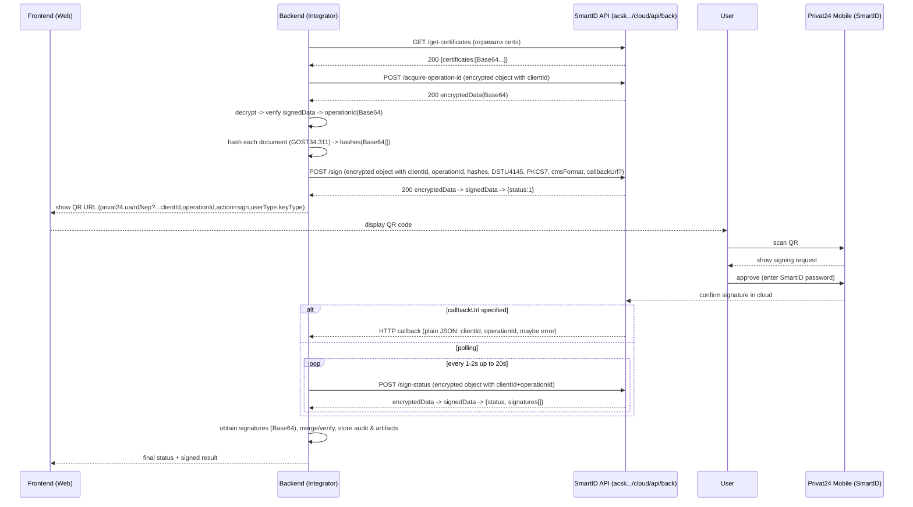

# SmartID (хмарний КЕП) ПриватБанку: технічний звіт для реалізації підпису у власному бекенді та фронтенді

## Executive summary

SmartID позиціонується ПриватБанком як **кваліфікований електронний підпис (КЕП)**, що зберігається у **хмарному сховищі**, юридично прирівнюється до власноручного підпису, і використовується через смартфон та застосунок Приват24 (зокрема через QR‑потік). citeturn0search4turn0search15

Для інтеграції з власною системою публічно доступна специфікація API “**Підключення до SmartID**” із базовим шляхом `https://acsk.privatbank.ua/cloud/api/back` та ендпоїнтами `/get-certificates`, `/acquire-operation-id`, `/sign`, `/sign-status` (версія `v1`). Ці виклики не є “простими JSON‑API”: запити/відповіді зазвичай **шифруються у форматі “зашифрований об’єкт”** з полями `authData` (Base64) і `encryptedData` (Base64), а результат після розшифрування подається як **“підписаний об’єкт”** (`signedData`, Base64). citeturn6view0turn17view3turn17view2

Ключові технічні вимоги/константи, які істотно впливають на дизайн: у `/sign` потрібно передавати список хешів `hashes` у Base64 із **лімітом 40**, алгоритм підпису фіксований як `DSTU4145`, формат підпису фіксований як `PKCS7`, а `cmsFormat` керує рівнем CAdES (у документі: `0` → CAdES‑T, `1` → CAdES‑X‑LONG). Для асинхронності доступні **callback** (лише `https` з портом `443`) або **polling** `/sign-status` кожні 1–2 секунди протягом до 20 секунд. citeturn15view0turn11view3turn11view2

Практична інтеграція майже завжди спирається на готові криптобібліотеки сімейства EndUser/EUSign (Java/JS/Node‑режими), оскільки специфікація включає: (а) розрахунок хешу алгоритмом **GOST 34.311** через метод `EndUser.Hash(...)`, (б) “сесійне” шифрування через `ClientDynamicKeySessionCreate(...)`, та (в) перевірку підпису/сертифікатів через `VerifyInternal(...)`, із вимогою додати кореневі сертифікати з `acsk.privatbank.ua/certificates/acsk`. citeturn16view0turn13view0turn10search6

Офіційна специфікація не описує (у публічній частині) такі критичні для продакшну речі як **RPS/квоти**, політики rate‑limit, SLA, а також чи потрібні **mTLS / API‑ключі / IP allow‑list** на рівні HTTP. Тому ці вимоги слід вважати **невизначеними** і закладати в план інтеграції фазу узгодження з ПриватБанком/КНЕДП на етапі підключення системи. citeturn6view0turn5search0

## SmartID: архітектура, ролі та модель довіри

SmartID — це модель “підпису як сервісу”, де приватний ключ (КЕП) не передається у вашу систему, а операція підтверджується користувачем у мобільному каналі. На рівні UX ПриватБанк описує сценарій як: відкрили документ → обрали SmartID → отримали QR → відсканували у Приват24 → підтвердили дію (паролем SmartID). citeturn0search4turn0search18turn6view0

У ролях інтеграції зазвичай присутні:

Ваша система (Relying Party / інтегратор) — бекенд створює “операцію підпису”, готує дані/хеші, викликає API, приймає callback або опитує статус, зберігає результат та аудит. citeturn6view0turn5search0

Користувач‑підписувач — підтверджує запит у мобільному застосунку. Для бізнес‑користувачів SmartID також описується як доступний через “Приват24 для бізнесу” і захищений кількома паролями (смартфон/застосунок/пароль підпису). citeturn0search15turn0search4turn0search11

Сервіс підпису та інфраструктура довіри КНЕДП — API повертає підпис у контейнері (PKCS#7/CMS) та передбачає OCSP/TSP/CMP‑інтеграцію для перевірки та довготривалої чинності. citeturn6view0turn5search0turn7search2turn7search1

У контексті права та регуляторики, базовим нормативним “каркасом” є Закон України №2155‑VIII, який визначає поняття/вимоги до електронних довірчих послуг і кваліфікованих підписів (для вас важливо: правила валідації, зберігання доказів, довірчі ланцюжки). citeturn9search0

## Офіційний SmartID API: ендпоїнти, версії, поля, callback і QR

### Базовий шлях, версія та загальна модель викликів

Офіційна специфікація вказує базовий шлях сервісу: `https://acsk.privatbank.ua/cloud/api/back`. Для об’єктів/ендпоїнтів зазначено “Актуальна версія: v1” і “Дефолтна версія: v1”, але у таблицях URL виведено як відносні `URL: /...` без явного правила, чи версія вшивається у шлях (наприклад `/v1/...`) або є “логічною” версією документації. Це — точка уточнення при підключенні. citeturn6view0turn12view3

### Таблиця ендпоїнтів SmartID API (офіційна специфікація)

| Ендпоїнт | HTTP метод | Відносний шлях | Основне призначення | Діагностично важливі поля |
|---|---:|---|---|---|
| Отримання сертифікатів сервісу підпису | GET | `/get-certificates` | Повертає `certificates: List<String(Base64)>` | Сертифікати потрібні, зокрема, для “сесійного” шифрування запитів. citeturn6view0 |
| Отримання ідентифікатора сесії | POST | `/acquire-operation-id` | Приймає `clientId`, повертає `operationId` (Base64, 88 символів) | `clientId` має формат `PREFIX_UUID`. citeturn6view0turn12view0 |
| Запит на підпис (по хешах документів) | POST | `/sign` | Запускає операцію підпису, повертає `status` | Потребує `hashes` (Base64, max 40), `signatureAlgorithmName=DSTU4145`, `signatureFormat=PKCS7`, можливий `callbackUrl`, можливий `cmsFormat`. citeturn15view0turn11view2 |
| Запит статусу/результату підпису | POST | `/sign-status` | Повертає `status` та `signatures[]` з `hash` і `signature` або `errorCode/errorMessage` | For polling: 1–2 сек до 20 сек (якщо немає callbackUrl). citeturn11view3turn11view2 |

### Callback‑модель

Якщо передати `callbackUrl` у `/sign`, після формування підпису сервіс робить запит на ваш URL із полями `clientId`, `operationId` і (опційно) `errorCode/errorMessage`. Важливо: документ прямо зазначає, що **цей callback‑запит “не шифрується”**, а також вимагає: `callbackUrl` має бути **тільки HTTPS зі стандартним портом 443**. citeturn15view0turn11view2

### QR‑потік (передача в Приват24)

Для показу користувачу QR‑коду інтегратор формує URL, який містить JSON‑фрагмент з `clientId`, `operationId`, `action`, `userType`, `keyType`. Також підтримується варіант “підпис + печатка” через `stampClientId`/`stampOperationId`. Типи `action` включають `auth`, `sign`, `encrypt`, `decrypt`; для підпису зазвичай використовується `sign`. citeturn15view0turn14view0turn14view3

Щоб уникнути помилок інтеграції, важливо розвести 2 різні “URL” поняття:
- **API URL** (виклики до `acsk.privatbank.ua/cloud/api/back/...`) — робить ваш сервер.
- **QR URL** (виклик `privat24.ua/rd/kep?...`) — відкриває Приват24 у мобільному каналі користувача. citeturn6view0turn14view0

## Формати даних і криптографія: Base64, сесійне шифрування, CMS/PKCS#7, CAdES, хешування

### Транспортні структури JSON (що реально передається по HTTP)

Специфікація визначає 3 базові “контейнери” даних:

“Зашифрований об’єкт (запит)” — JSON з полями:
- `authData`: “зашифрований сесійний ключ” (Base64)
- `encryptedData`: “зашифровані дані” (Base64) citeturn17view3turn6view0

“Зашифрований об’єкт (відповідь)” — JSON з `encryptedData` (Base64). citeturn6view0

“Підписаний об’єкт” — JSON з `signedData` (Base64). У типовому потоці після розшифрування відповіді інтегратор отримує `signedData` і має перевірити підпис, щоб витягнути бізнес‑payload (наприклад `operationId`). citeturn6view0turn12view0

Ця модель узгоджується з тим, що “SignedData/EnvelopedData” найчастіше реалізують поверх **CMS (Cryptographic Message Syntax)**, стандарт якої описаний в RFC 5652. citeturn7search0

### Як реалізується шифрування запитів у прикладах (EndUser/EUSign)

Публічна специфікація містить фрагменти коду, де клієнт (інтегратор) бере сертифікат сервісу (отриманий з `/get-certificates`) і створює “динамічну сесію ключів” з TTL, наприклад 900 секунд: `ClientDynamicKeySessionCreate(900, serverCert)`. Потім:
- `encryptedData = SessionEncrypt(session, req)`
- `authData = Base64(session.GetData())`
- відповідь розшифровує `SessionDecrypt(...)`. citeturn16view0turn13view0turn17view3

Це важливий практичний висновок для архітектури: навіть якщо бізнес‑payload — це “прості JSON‑поля”, вам потрібен криптомодуль/SDK, який відтворює саме цю схему сесійного шифрування і сумісний із сервісом. citeturn16view0turn6view0

### Хешування документів

У специфікації прямо зазначено: хеш розраховується з документа, який треба підписати, для обчислення використовується алгоритм **GOST 34.311**, а метод `EndUser.Hash(byte[] data)` повертає Base64‑рядок хешу. citeturn16view0turn11view3

Наслідок: якщо ви намагаєтесь “самостійно” рахувати хеш сторонньою криптобібліотекою, ви повинні 100% гарантувати ідентичність алгоритму, параметрів, кодувань і байтового представлення — інакше підпис повернеться, але не буде валідуватися на вашому боці. Тому в більшості інтеграцій безпечніше використовувати метод хешування SDK, який наведено у специфікації. citeturn16view0turn7search0

### Параметри підпису: DSTU4145, PKCS7, CAdES

У запиті `/sign` обов’язково задаються:
- `signatureAlgorithmName: "DSTU4145"`
- `signatureFormat: "PKCS7"` citeturn15view0turn11view2

Додатково:
- `cmsFormat: 0` означає “базовий формат (CAdES‑T)”
- `cmsFormat: 1` означає “розширений (CAdES‑X‑LONG)” citeturn15view0turn11view2

З точки зору міжнародних стандартів, CAdES — це профіль CMS із підписаними/непідписаними атрибутами, що прямо описано у ETSI EN 319 122‑1 (включно з тим, що CAdES “builds on CMS (RFC 5652)”). citeturn7search7turn7search0

### OCSP/TSP/CMP: адреси та стандарти

У прикладах налаштування бібліотеки для роботи з PKI сервісами наведені URL:
- CMP: `http://acsk.privatbank.ua/services/cmp/` (порт 80)
- TSP: `http://acsk.privatbank.ua/services/tsp/` (порт 80)
- OCSP: `http://acsk.privatbank.ua/services/ocsp/` (порт 80) citeturn16view0turn13view2turn13view0

Функціонально:
- OCSP описано стандартом RFC 6960 (перевірка статусу сертифіката без CRL). citeturn7search2  
- TSP/позначка часу описана RFC 3161. citeturn7search1  

Кореневі сертифікати для перевірки підписів, за інструкцією, потрібно додати в локальне сховище бібліотеки; вони доступні з `acsk.privatbank.ua/certificates/acsk`. citeturn16view0turn10search6

## Процес інтеграції backend & frontend: кроки, сценарії, приклади HTTP і коду, mermaid

### Рекомендована рольова розкладка (що робить бекенд, що робить фронт)

Бекенд:
- формує документ(и) або приймає їх від вашого продукту;
- рахує хеші GOST 34.311 (через SDK);
- викликає API (отримує `operationId`, запускає `/sign`, читає `/sign-status`);
- зберігає “evidence”: оригінал, підпис(и), метадані запиту, журнали аудиту;
- проводить валідацію підпису через `VerifyInternal(...)` та PKI‑перевірки. citeturn16view0turn11view3turn5search0

Фронтенд:
- показує користувачу документ/назви документів і QR‑код;
- забезпечує UX для очікування (spinner + тайм‑аут), оновлення статусу;
- приймає повідомлення від бекенду (WebSocket/SSE/long‑poll) після callback або polling‑завершення. citeturn14view0turn11view2turn11view3

### Повний SmartID‑потік у mermaid sequence



Параметри QR URL, callback vs polling і статуси 0–4 у `/sign-status` відповідають офіційній специфікації SmartID. citeturn15view0turn11view3turn11view2turn14view0

### Сценарії інтеграції

**Real‑time підпис одного або кількох документів.** Це “стандарт”: бекенд створює `operationId`, віддає QR, очікує callback або poll (до 20 сек), повертає результат. citeturn11view2turn11view3turn14view0

**Batch‑підпис.** Критичне обмеження — `hashes` містить максимум 40 елементів, отже великі пакети потрібно ділити на кілька операцій: або 1 QR на кожну пачку, або UX “підписати N пачок послідовно”. citeturn15view0turn11view2

**Підпис + печатка (для юросіб).** QR‑параметр `keyType` підтримує `0` (підпис), `1` (печатка), `2` (підпис+печатка). Для одночасного підтвердження двох підписів у QR можна передати `stampClientId` і `stampOperationId`. citeturn14view3turn14view0

### Приклади HTTP‑запитів (адаптовні шаблони)

Нижче — “каркас” HTTP. У реальному виклику `authData/encryptedData` формуються SDK (див. розділ про шифрування). citeturn17view3turn16view0

```http
GET /cloud/api/back/get-certificates HTTP/1.1
Host: acsk.privatbank.ua
Accept: application/json
```

```http
POST /cloud/api/back/acquire-operation-id HTTP/1.1
Host: acsk.privatbank.ua
Content-Type: application/json

{
  "authData": "<Base64>",
  "encryptedData": "<Base64>"
}
```

```http
POST /cloud/api/back/sign HTTP/1.1
Host: acsk.privatbank.ua
Content-Type: application/json

{
  "authData": "<Base64>",
  "encryptedData": "<Base64>"
}
```

```http
POST /cloud/api/back/sign-status HTTP/1.1
Host: acsk.privatbank.ua
Content-Type: application/json

{
  "authData": "<Base64>",
  "encryptedData": "<Base64>"
}
```

Callback (якщо `callbackUrl` задано) — прикладний payload (у специфікації зазначено, що він **не шифрується**): citeturn15view0turn11view2

```http
POST /your-callback-endpoint HTTP/1.1
Content-Type: application/json

{
  "clientId": "PREFIX_UUID",
  "operationId": "<Base64 88 chars>",
  "errorCode": 0,
  "errorMessage": ""
}
```

### Приклади коду (Node.js / Python / Browser JS)

#### Node.js (бекенд): оркестрація, callback/polling, idempotency (псевдокод)

```javascript
/**
 * Примітка:
 * - encryptPayload/decryptAndVerify — це обгортки над SDK (EndUser/EUSign),
 *   які реалізують SessionEncrypt/SessionDecrypt та перевірку signedData.
 * - Відповідь з помилкою може прийти без шифрування/підпису — треба обробляти окремо.
 */

async function smartIdFlow({ clientId, documents, callbackUrl }) {
  const certs = await httpGetJson("https://acsk.privatbank.ua/cloud/api/back/get-certificates");
  const serverCertBase64 = certs.certificates[0]; // політика вибору cert — узгодити/перевірити

  // 1) operationId
  const opReq = { clientId };
  const opEncrypted = encryptPayload(opReq, serverCertBase64);
  const opResp = await httpPostJson("https://acsk.privatbank.ua/cloud/api/back/acquire-operation-id", opEncrypted);
  const opPayload = decryptAndVerify(opResp, serverCertBase64);
  const operationId = opPayload.operationId;

  // 2) hashes (GOST34.311 через SDK)
  const hashes = documents.map(bytes => gostHashBase64(bytes)); // SDK method EndUser.Hash(...)
  // якщо hashes.length > 40, розбити на пачки

  // 3) /sign
  const signReq = {
    clientId,
    operationId,
    time: formatDateTimeUtcOrLocal(),          // yyyy-MM-dd HH:mm:ss
    originatorDescription: clientId.split("_")[0],
    hashes,
    signatureAlgorithmName: "DSTU4145",
    signatureFormat: "PKCS7",
    cmsFormat: 0,
    callbackUrl // optional, must be https:443
  };

  const signEncrypted = encryptPayload(signReq, serverCertBase64);
  const signResp = await httpPostJson("https://acsk.privatbank.ua/cloud/api/back/sign", signEncrypted);
  const signPayload = decryptAndVerify(signResp, serverCertBase64);

  // статус 1 означає "операція розпочата" (запит відправлено клієнту)
  if (signPayload.status !== 1) {
    throw new Error(`Unexpected sign status: ${signPayload.status}`);
  }

  // 4) Далі або callback, або polling /sign-status
  if (callbackUrl) {
    return { operationId, mode: "callback" };
  }

  const deadline = Date.now() + 20_000;
  while (Date.now() < deadline) {
    await sleep(1200);

    const statusEncrypted = encryptPayload({ clientId, operationId }, serverCertBase64);
    const statusResp = await httpPostJson("https://acsk.privatbank.ua/cloud/api/back/sign-status", statusEncrypted);

    // Важливо: при помилці відповідь може бути plaintext JSON
    if (statusResp.errorCode) throw new Error(`${statusResp.errorCode}: ${statusResp.errorMessage}`);

    const statusPayload = decryptAndVerify(statusResp, serverCertBase64);

    if (statusPayload.status === 2) return statusPayload; // signatures ready
    if (statusPayload.status === 3) throw new Error("User rejected signature");
    if (statusPayload.status === 4) throw new Error("Client-side error in mobile flow");
  }

  throw new Error("Timeout waiting for SmartID signature");
}
```

Поля `clientId`, `operationId`, параметри `signatureAlgorithmName/signatureFormat/cmsFormat`, таймінги polling і правило callbackUrl взяті зі специфікації. citeturn15view0turn11view2turn11view3

#### Python (бекенд): валідація відповіді та склейка результатів (псевдокод)

```python
def normalize_signatures(sign_status_payload: dict) -> dict:
    """
    Очікувана структура:
      status: int
      signatures: [{hash: Base64, signature: Base64} | {hash: Base64, errorCode, errorMessage}]
    """
    status = sign_status_payload["status"]
    if status != 2:
        return {"status": status, "signatures": []}

    ok, failed = [], []
    for item in sign_status_payload.get("signatures", []):
        if "signature" in item:
            ok.append(item)
        else:
            failed.append(item)

    return {
        "status": status,
        "ok": ok,
        "failed": failed,
    }
```

Структура `status` і `signatures[]` з `hash/signature` або `hash/errorCode/errorMessage` відповідає офіційній специфікації. citeturn11view3turn16view0

#### Browser JS (фронтенд): підключення бібліотеки та CORS/proxy нюанс

Специфікація містить приклад підключення JS‑бібліотеки через файли `euscpt.js`, `euscpm.js`, `euscp.js` і механізм callback‑функцій `EUSignCPModuleLoaded()` / `EUSignCPModuleInitialized(isInitialized)`. citeturn11view1turn16view0

Також вона підкреслює, що через політику безпеки браузерів взаємодія з серверами ЦСК можлива лише за умови кросдоменного механізму, і рекомендує реалізувати proxy‑сервіс, який приймає запити виду `/proxy?address=http://ca.server.ua` (proxy‑endpoint задається методом `SetXMLHTTPProxyService`). citeturn16view0

```html
<script src="euscpt.js"></script>
<script src="euscpm.js"></script>
<script async src="euscp.js"></script>

<script>
function EUSignCPModuleInitialized(isInitialized) {
  if (!isInitialized) {
    console.error("EUSignCP init failed");
    return;
  }
  const endUser = EUSignCP();

  // Приклад: налаштування proxy handler для крос-доменних викликів
  endUser.SetXMLHTTPProxyService("/proxyHandler");

  // Далі — ваша логіка UI (QR отримуєте з бекенду)
}
</script>
```

## Безпека, помилки, логування, тестування, деплой, таймлайн і пріоритетні джерела

### Обробка помилок і коди/статуси

Специфікація визначає єдиний формат помилок: `errorCode`, `errorMessage`, а також опційні `additionalErrorCode/additionalErrorMessage`. citeturn6view0turn12view0

Для `/sign-status` визначено `status`:
- `0` — операція зареєстрована (виділено ідентифікатор)
- `1` — операція розпочата (запит надіслано клієнту)
- `2` — операція оброблена (клієнт підтвердив)
- `3` — клієнт відхилив
- `4` — помилка при обробці клієнтом citeturn11view3

У масиві `signatures` результат може бути частково успішним: для кожного `hash` або повертається `signature`, або повертаються `errorCode/errorMessage` (у прикладі фігурує `504`). citeturn16view0turn11view3

Критична операційна деталь: у документі зазначено, що **в разі виникнення помилки відповідь не шифрується та не підписується**, а отже ваш клієнтський код має спершу пробувати “plaintext error JSON”, і лише якщо його немає — виконувати розшифрування/перевірку підпису. citeturn11view3

### Автентифікація/авторизація: що відомо і що невідомо

Відомо з публічної специфікації:
- `clientId` має формат `PREFIX_UUID`, де `PREFIX` — ідентифікатор системи‑інтегратора. citeturn12view0turn15view0  
- `operationId` — Base64‑рядок довжиною 88 символів, видається через `/acquire-operation-id`. citeturn12view0  
- `/get-certificates` повертає Base64‑сертифікати сервісу підписів, які використовуються для криптообміну (шифрування/верифікації). citeturn6view0turn16view0  

Невідомо/не описано публічно (тому треба уточнювати у ПриватБанку при підключенні):
- чи потрібні HTTP‑токени/API‑ключі;
- чи потрібен mTLS/клієнтський сертифікат на транспортному рівні;
- чи застосовується IP allow‑list, і які квоти/RPS. citeturn6view0turn5search0

Дизайн‑порада: навіть якщо документ “мовчить” про mTLS, продакшн‑інтеграцію варто проєктувати так, щоб додавання mTLS (або підписаних JWT‑заголовків) було можливим без “ламання” API‑шару (наприклад, через gateway). Це — архітектурна рекомендація, а не підтверджена вимога. citeturn8search1

### TLS, replay/CSRF та захист callback‑endpoint

Транспортна безпека: TLS 1.3 стандартизований у RFC 8446 як протокол, що зменшує ризики підслуховування/підміни/підробки повідомлень. citeturn8search1  
Для callbackUrl SmartID прямо вимагає HTTPS:443, отже ваш inbound endpoint має підтримувати сучасні TLS‑налаштування та бути захищеним від DoS/rate spikes. citeturn11view2turn15view0

Replay‑захист: базова “одноразовість” у SmartID забезпечується `operationId`, але на вашому боці потрібно:
- робити `operationId` idempotent (приймати результат рівно один раз, далі — повертати кеш);
- задавати TTL на очікування та кореляцію сесії підпису з вашим документом. citeturn11view3turn12view0

CSRF: у веб‑фронтенді, де є “підписати” як state‑changing дія, застосовуйте стандартні заходи проти CSRF (токени, перевірка Origin/Referer, SameSite cookie). Це узгоджується з рекомендаціями entity["organization","OWASP","web app security org"] щодо CSRF‑захисту. citeturn8search3turn8search7

### Зберігання ключів та HSM‑аспекти

З боку інтегратора SmartID зручний тим, що приватний ключ підписувача не потрапляє у вашу систему (зменшується клас ризиків “витік ключа”). Це узгоджується з маркетинговим позиціонуванням “зберігається в хмарі, неможливо втратити/викрасти/скопіювати”. citeturn0search4turn0search15

Чи реалізовано хмарне сховище ключів на HSM — у публічній офіційній специфікації API не деталізується. Як альтернативне джерело (не офіційна документація продукту), в окремих публікаціях/навчальних матеріалах згадується застосування мережних криптомодулів “Гряда‑301” у відмовостійкому кластері для хмарного КЕП, а виробник крипторішень описує “Гряда‑301” як модуль для зберігання/захисту ключів і апаратного виконання криптоперетворень. Цю інформацію варто трактувати як **індикативну**, а не як контрактну специфікацію SmartID. citeturn2search19turn18search8

### Логування та аудит (мінімально достатній набір)

У контексті електронних довірчих послуг вам потрібен аудит‑ланцюг “хто‑що‑коли‑над‑чим підписав”, і технічні журнали для розбору інцидентів/спорів. Регламент КНЕДП ПриватБанку на рівні принципів фіксує надання/перевірку КЕП і кваліфікованої позначки часу як складових довірчих послуг, що підкреслює важливість повної трасованості. citeturn5search0

Практично рекомендовано логувати (без витоку персональних/секретних даних):
- `clientId`, `operationId`, час старту, час завершення, результат `status`;
- кількість `hashes`, їхні ідентифікатори (можна зберігати тільки хеші, без документів у логах);
- інформацію про підписувача, яку ви витягаєте при `VerifyInternal(...)` (наприклад DRFO/EDRPOU, CN видавця) — з урахуванням вимог мінімізації персональних даних. citeturn16view0turn11view3turn8search0

### Обмеження та таблиця контрольних лімітів

| Параметр/ліміт | Значення | Статус визначеності |
|---|---:|---|
| `hashes` у `/sign` | ≤ 40 | Визначено у специфікації. citeturn15view0turn11view2 |
| Polling `/sign-status` | кожні 1–2 сек до 20 сек | Визначено у специфікації. citeturn11view2turn11view3 |
| `callbackUrl` | лише `https` з портом 443 | Визначено у специфікації. citeturn11view2turn15view0 |
| Сесійне шифрування (TTL прикладу) | 900 секунд | Є в прикладі коду; фактичну політику узгодити. citeturn16view0turn13view0 |
| RPS/квоти/ліміти трафіку | не описано | Невідомо (потрібне партнерське уточнення). citeturn6view0 |
| Максимальний “розмір документа” | напряму не передається (передаються хеші) | Залежить від вашого сховища/каналів і від того, як ви рахуєте хеш. citeturn16view0turn15view0 |

### Рекомендації з тестування і деплою

Тестування сумісності (interop) повинно охоплювати: (1) повторюваність хешування (GOST 34.311) для різних типів документів, (2) стабільність сесійного шифрування (authData/encryptedData), (3) обробку частково‑успішних пакетів (частина `hashes` з `signature`, частина з `errorCode`), (4) callback vs polling та тайм‑аути. citeturn16view0turn11view3turn11view2

Для криптовалідації опирайтесь на стандарти: CMS (RFC 5652), X.509 (RFC 5280), OCSP (RFC 6960), TSP (RFC 3161), і на ETSI CAdES (EN 319 122‑1), щоб коректно трактувати атрибути довготривалого підпису. citeturn7search0turn8search0turn7search2turn7search1turn7search7

Деплой‑порада: якщо ви використовуєте NodeJS‑модуль/обгортку криптобібліотеки, врахуйте, що в специфікації прямо згадано блокування основного потоку NodeJS і рекомендацію встановити модуль `sleep` для зменшення навантаження при запитах до серверів АЦСК. У продакшні краще ізолювати криптообчислення у worker‑процеси/черги. citeturn16view0

### Таймлайн інтеграції (реалістична оцінка етапів)

Фаза аналізу та узгодження доступу (clientId, юридичні документи, невідомі вимоги до авторизації/квот) зазвичай є критичним шляхом і може бути довшою за розробку коду. Це випливає з того, що частина параметрів у публічній специфікації не визначена і потребує партнерського підключення. citeturn6view0turn5search0

Практично (для середньої команди) типовий графік виглядає так:
- 1–2 тижні: POC (QR‑потік + polling, один документ, мінімальна валідація). citeturn14view0turn11view3  
- 1–2 тижні: продакшн‑укріплення (callback endpoint, idempotency, аудит, моніторинг, CSRF‑захист). citeturn8search3turn11view2  
- 1–2 тижні: пакетні сценарії, часткові помилки, довготривала перевірка (OCSP/TSP), документація для підтримки. citeturn11view3turn7search2turn7search1  

### Пріоритетні джерела

Офіційна специфікація інтеграції SmartID API “Підключення до SmartID” (ендпоїнти, формати, QR, callback, обмеження). citeturn6view0turn11view3turn15view0

Регламент КНЕДП ПриватБанку (умови надання довірчих послуг, організаційно‑технічні засади). citeturn5search0

Офіційні сторінки SmartID ПриватБанку (позиціонування, юридична сила, хмарне зберігання, “сихронізований” мобільний UX через QR). citeturn0search4turn0search15turn0search18

Кореневі/сервісні сертифікати КНЕДП на сайті АЦСК (джерело ланцюжків для валідації). citeturn10search6turn16view0

Нормативи України: Закон №2155‑VIII; пов’язані урядові/регуляторні акти (для комплаєнсу інтегратора). citeturn9search0turn9search1turn9search3

Оригінальні стандарти: CMS (RFC 5652), X.509 (RFC 5280), OCSP (RFC 6960), TSP (RFC 3161), TLS 1.3 (RFC 8446), ETSI CAdES (EN 319 122‑1). citeturn7search0turn8search0turn7search2turn7search1turn8search1turn7search7

Альтернативні джерела (коли бракує офіційного): приклади/референси криптобібліотек українських стандартів (наприклад Cryptonite з дефолтним TSP для `acsk.privatbank.ua`), матеріали виробника крипторішень щодо HSM‑класу модулів; науково‑навчальні матеріали, де трапляються “повні URL” як конкатенація базового шляху з ендпоїнтами — використовувати обережно і позначати як неофіційне. citeturn10search1turn18search8turn18search1turn2search19