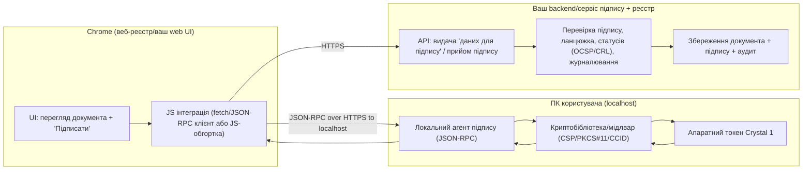
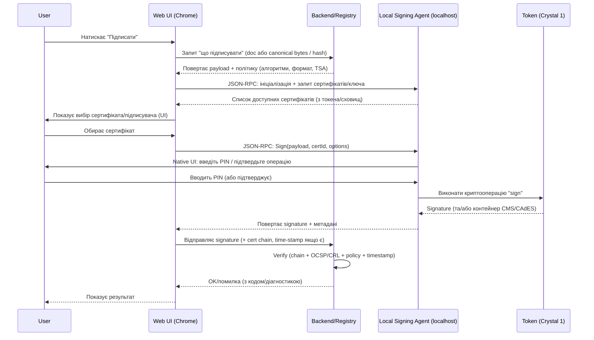

# Підпис документів у Chrome через локальний агент і апаратний токен Crystal 1: цільова модель інтеграції, протоколи, безпека та план впровадження

## Резюме керівника

Ваша вимога “підпис у браузері Chrome через токен + локальний агент без розширення” найкраще відповідає моделі **локального агента підпису, доступного з веб‑сторінки через JSON‑RPC по HTTP(S) на localhost**. Саме така схема прямо описана для web‑бібліотек підпису “користувача ЦСК” (у т.ч. режим “Агент підпису”) — доступ з веб‑браузера здійснюється через **JSON‑RPC запити по HTTP(S) на локальному вузлі (localhost)** безпосередньо з JavaScript‑обгортки. citeturn36view0turn31view0

Ключові технічні наслідки для архітектури:

- Локальний агент відкриває **фіксовані (за замовчуванням) порти 8081 (HTTP) і 8083 (HTTPS)**, які можуть бути параметризовані в налаштуваннях агента; з боку ОС у брандмауері має бути дозволено підключення до цих портів. citeturn23view0turn31view2  
- Доступ до функцій локального агента контролюється не лише CORS/браузером, а й **внутрішнім allow‑list “Довірені web‑сайти”**: сайт, якого немає в списку, буде запропоновано додати. Це — критичний елемент моделі безпеки “веб‑сторінка → локальний агент”. citeturn23view0turn31view2  
- Для сценаріїв, де агент не може працювати (багатокористувацький режим Windows Server; середовища з обмеженням на відкриття фіксованих локальних портів, напр. AVD), виробник прямо вказує на необхідність **web‑розширення + Native Messaging Host (NMH)** замість агента. Це важливе “обмеження застосовності” вашої вимоги “без розширення”. citeturn36view0  
- Екосистема токена Crystal 1 орієнтована на апаратне виконання криптооперацій: токен має доступ через **власний протокол і CCID**, а криптографічні перетворення виконуються всередині пристрою, що унеможливлює доступ до приватних ключів із ПК. citeturn19view0  

Юридично-регуляторні вимоги для КЕП в Україні впливають на перевірку та довготривалу валідність: закон визначає, що **кваліфікований електронний підпис** — це удосконалений підпис, створений засобом КЕП і на кваліфікованому сертифікаті, а також встановлює вимоги до засобів КЕП (конфіденційність/унікальність/захист ключа тощо). citeturn28view0turn27view5 Для державних установ окремо зафіксовано обов’язковість **кваліфікованої електронної позначки часу під час накладання КЕП** (для їхнього документообігу). citeturn24view0

Рекомендована стратегія розробки сервісу інтеграції:

1) Вважати локальний агент “криптографічним адаптером”, а ваш веб‑сервіс — “оркестратором” (підготовка даних, валідація, аудит, помилки).  
2) Будувати інтеграцію навколо **HTTPS‑порту агента (8083)** з коректно встановленим SSL‑сертифікатом агента та контрольованими дозволами “Local network access” у Chrome, оскільки в Chrome 138+ з увімкненою перевіркою доступу до локальної мережі потрібне явне підтвердження доступу сайту до локалки. citeturn36view0turn20search1  
3) Закласти у вимоги та тестування сценарії зміни політик браузера (Private/Local Network Access), оскільки Chrome поступово посилює обмеження на запити до локальної/приватної мережі (через preflight/дозволи). citeturn20search26turn20search13  

## Контекст та обмеження платформи

### Браузерний “коридор можливостей” без розширень

У моделі “звичайна веб‑сторінка в Chrome” є принципова межа: сторінка не може напряму завантажувати драйвери/модулі PKCS#11, працювати зі смарт‑картами на рівні ОС або викликати довільні локальні процеси — для цього потрібні або (а) **локальний мережевий міст (localhost service)**, або (б) **браузерне розширення** (зокрема для Native Messaging). Фактично, документація виробника web‑бібліотек прямо фіксує дві реалізації:  
- **Native messaging host (NMH‑модуль)**: доступ із браузера через stdio **через JavaScript‑обгортку та web‑розширення**;  
- **Агент підпису**: доступ із браузера через **JSON‑RPC по HTTP(S) на localhost** безпосередньо із JavaScript‑обгортки. citeturn36view0turn31view0

Оскільки ви вимагаєте “без розширення”, практично придатним шляхом залишається **“Агент підпису”**.

### Нові обмеження Chrome на доступ до локальної мережі

У Chrome з’являється дозвільна модель “Local Network Access” (LNA). У Chrome 138 доступне opt‑in тестування, де користувачі можуть увімкнути флаг `chrome://flags#local-network-access-check` і отримувати новий permission prompt на локальні запити. citeturn20search1

В інструкції до web‑бібліотек підпису прямо зазначено: **для Chrome 138+ при увімкненій перевірці доступу до локальної мережі** для роботи агента потрібно “явний дозвіл” для веб‑сайту (“Дозволити”). citeturn36view0

Паралельно Chrome розвиває Private Network Access (PNA): механізм, який обмежує запити з веб‑сторінок до адрес “менш публічних” мереж і вводить preflight‑перевірки, щоб зменшити ризики CSRF/зловживань проти локальної мережі. citeturn20search26  
Це означає, що інтеграція через localhost має бути спроєктована так, щоб пережити посилення політик браузера (дозволи, preflight, CORS‑вимоги).

### Обмеження середовищ виконання

Виробник фіксує два важливих обмеження, які впливають на “підпис без розширень”:

- Агент підпису **не підтримує роботу в багатокористувацькому режимі**, тому в Windows Server для роботи пропонується використовувати web‑розширення та NMH‑модуль (або інші спадкові технології). citeturn36view0  
- В Azure Virtual Desktop (AVD) можуть діяти обмеження, які **не дозволяють відкривати фіксовані локальні порти 8081/8083**, необхідні агенту; там також пропонується web‑розширення + NMH‑модуль. citeturn36view0  

Практична вимога для вашого проєкту: у “production” потрібно мати чіткий policy‑документ, де агенто‑орієнтований шлях підтримується лише на клієнтських ОС/конфігураціях (звичайний Windows desktop), а для VDI/Server — або інший канал, або офіційний “extension+NMH” як fallback.

## Архітектура та потоки даних

### Цільова логічна архітектура

Функціонально ланцюжок виглядає так:

- **Web‑додаток/реєстр у Chrome** формує дані, які треба підписати (байти документа або хеш/“дані для підпису”), ініціює операцію підпису.  
- **Локальний агент** приймає виклик із браузера по localhost (JSON‑RPC), керує взаємодією з користувачем (вибір ключа/сертифіката, введення PIN), звертається до криптобібліотек/драйверів токена. citeturn31view2turn32view0  
- **Токен Crystal 1** виконує криптографічні операції всередині пристрою; приватний ключ не повинен ставати доступним ОС. citeturn19view0  
- Результат (підпис/контейнер) повертається у браузер і відправляється у ваш backend/реєстр для зберігання та перевірки.

Нижче — рекомендована схема з чіткими “межами довіри”.



Опорні факти для цієї архітектури: доступ до агента описано як JSON‑RPC по HTTP(S) на localhost; агент має керовані порти та список довірених сайтів. citeturn31view2turn36view0

### Послідовність “підписати документ” у браузері

Типова безпечна послідовність має мінімізувати ризик підпису “не того, що показано” і забезпечити трасованість:



Елементи “native UI” та керування параметрами доступу до носія/паролю документовані як режими “запитувати у оператора” або “фіксовані параметри” (коли параметри доступу та пароль зберігаються у програмі, і наступні зчитування ключа відбуваються без запиту). citeturn32view0

## Компоненти, протоколи та варіанти інтеграції

### Обов’язкові компоненти у вашому випадку

Нижче — практичний “BOM” (bill of materials) для інтеграції “Chrome + локальний агент + Crystal 1”, узгоджений з офіційними описами web‑бібліотек та токена.

| Шар | Компонент | Роль | Примітки/вимоги |
|---|---|---|---|
| Браузер | Chrome (desktop) | UI, запуск підпису, виклик localhost | Для Chrome 138+ можливий дозвіл “Local network access” (особливо при увімкненому флагу перевірки). citeturn36view0turn20search1 |
| Web | Ваш web‑додаток/реєстр + JS інтеграція | Формує payload, керує UX, приймає результат | Має працювати з localhost‑викликами, обробляти помилки агента, забезпечити журналювання на сервері. |
| Localhost | Локальний агент підпису | JSON‑RPC сервер на localhost; UI для PIN/ключа; контроль allow‑list сайтів | Порти HTTP/HTTPS налаштовуються (типові 8081/8083), список довірених сайтів; потрібні правила брандмауера. citeturn31view2turn23view0 |
| Localhost | Криптобібліотека/провайдери | Доступ до ключів/сертифікатів, OCSP/TSP/LDAP, формати підпису | Бібліотеки “користувача ЦСК” підтримують роботу з носіями, сховищем сертифікатів/CRL, OCSP/LDAP/TSP. citeturn19view0turn36view0 |
| Пристрій | Crystal 1 | Захищене зберігання ключів/виконання криптооперацій | Доступ: власний протокол та CCID; криптоперетворення в середині пристрою; приватні ключі не мають бути доступні ПК. citeturn19view0 |
| Server | Ваш backend сервіс | Видача даних, прийом підпису, валідація, аудит | Має перевіряти ланцюжки/статуси/позначки часу за політикою. |

Доступність інсталяційних пакетів та оновлень для web‑бібліотек фіксується на сторінці завантажень; станом на кінець лютого 2026 опубліковані інсталятори для Windows та пакети для Linux. citeturn34view0

### Протоколи та API на кожній межі

**Браузер → локальний агент (без розширення)**  
- JSON‑RPC поверх HTTP(S) на `localhost`. citeturn31view0turn36view0  
- Порт/HTTPS: агент має налаштування “HTTP‑порт” та “HTTP(S)‑порт”, із вимогою дозволити у брандмауері ОС підключення до цих портів. citeturn31view2turn23view0  
- Контроль доступу: “Довірені web‑сайти” (allow‑list) та інтерактивне додавання сайту при першому зверненні. citeturn31view2turn23view0  

**Браузер → локальний процес (Native Messaging, як альтернативний варіант)**  
Це **не відповідає** вашій вимозі “без розширення”, але важливо для порівняння та fallback‑сценаріїв (Windows Server/AVD). citeturn36view0  
- Chrome Native Messaging визначений як канал **розширення ↔ native host**. citeturn20search0turn38view0  
- Host manifest задає `name`, `path`, `type: stdio`, `allowed_origins` і реєструється (на Windows) через ключі реєстру `HKLM/HKCU\Software\Google\Chrome\NativeMessagingHosts\...`. citeturn38view0  
- Протокол stdio: JSON (UTF‑8) з 32‑бітним префіксом довжини; ліміти розміру повідомлень описані у документації. citeturn38view0  

**Локальний агент → токен/криптопровайдер**  
- Для токенів у таких системах типовими інтерфейсами є **PKCS#11** і/або **Microsoft CSP** (у Windows‑екосистемі), а також CCID/PCSC на рівні смарт‑карт. Інтеграційні інтерфейси “Microsoft CSP, PKCS#11 …” прямо перелічені у описі бібліотек. citeturn19view0  
- PKCS#11 (Cryptoki) — стандартизований інтерфейс до криптотокенів; базова специфікація описує типи даних/функції/об’єкти. citeturn39search2  
- У Windows “CSP” належить до CryptoAPI, а “CNG” має власні класи провайдерів (в т.ч. Key Storage Providers); Microsoft документує відмінності провайдерів CryptoAPI та CNG. citeturn39search1turn39search29  

**Формати та криптоконтейнери**  
- Підписані дані можуть бути оформлені як CMS/PKCS#7; CMS описаний у RFC 5652 як синтаксис для підпису/дайджесту/автентифікації/шифрування довільного вмісту. citeturn39search4  
- Для CAdES‑профілів вказано використання відповідних ETSI стандартів у характеристиках комплексу (див. нижче про криптоалгоритми та формати). citeturn19view0  

### Порівняння варіантів інтеграції (з фокусом на ваші вимоги)

| Варіант | Чи можливий без розширення? | Канал браузер ↔ локальний код | Плюси | Мінуси/ризики | Типове застосування |
|---|---:|---|---|---|---|
| Localhost HTTP(S) JSON‑RPC (агент) | Так | `fetch`/XHR до `https://localhost:<port>` | Найближче до вашого кейса; контроль “довірені сайти”; можливість native UI | Залежить від політик Chrome (LNA/PNA), firewall; потрібен SSL‑сертифікат агента; ризик зловживань з боку шкідливих сайтів без allow‑list | Держсервіси/реєстри на desktop Windows; інтеграції без розширень. citeturn31view2turn36view0turn20search26 |
| Native Messaging (NMH) | Ні (потрібне розширення) | stdio (extension ↔ host) | Без відкриття портів; добре для VDI/Server; сильніша модель “не мережевого” каналу | Потрібне розширення; складніше розгортання (manifest/registry); політики enterprise | Fallback для Windows Server/AVD; корпоративні середовища. citeturn36view0turn38view0 |
| “Прямий PKCS#11 у браузері” | Практично ні | Немає нативного web‑API | Мінімальна латентність (теоретично) | Браузерна пісочниця не дає напряму працювати з PKCS#11; все одно потрібен міст (agent/extension/desktop app) | Не рекомендовано; замінюється агентом або розширенням. citeturn20search0turn36view0 |

## UX, криптографія та життєвий цикл сертифікатів

### UX взаємодії з користувачем: PIN, кешування, підтвердження

Критично важливо: **PIN не має вводитися у DOM веб‑сторінки** (це відкриває ризики перехоплення через XSS/розширення/скрін‑логери на рівні браузера). Коректна модель — запит PIN у **native UI агента/криптобібліотеки**.

Офіційно задокументовано два режими доступу до носія ключової інформації (НКІ):  
- “запитувати у оператора” — при кожній необхідності використання ключа показується діалог, де вказуються тип носія та пароль;  
- “фіксовані параметри” — параметри доступу (включно з паролем) встановлюються один раз і **зберігаються у програмі**, а наступні зчитування відбуваються без запиту. citeturn32view0  

З позиції безпеки це означає:

- “Фіксовані параметри” = UX‑зручність, але **підвищення ризику компрометації** (пароль/параметри зберігаються локально). Використовувати лише в керованих середовищах із жорстким endpoint‑hardening і чітким ризик‑прийняттям. citeturn32view0  
- Для масового держреєстру зазвичай потрібно або вимагати PIN кожну сесію, або забезпечити короткоживучий “session unlock” із таймаутом та явним індикатором.

Окремий UX‑момент у Chrome: при LNA‑перевірці користувачу може показуватися промпт доступу сайту до локальної мережі, і без “Allow/Дозволити” підпис не запрацює. citeturn20search1turn36view0

### Криптоалгоритми та формати: що очікувати від стеку

Опис комплексу бібліотек користувача ЦСК (і сумісних носіїв) містить перелік підтримуваних алгоритмів та форматів:

- ЕЦП: ДСТУ 4145‑2002, RSA (PKCS#1 / RFC 3447), ECDSA (за ДСТУ ISO/IEC 14888‑3). citeturn19view0  
- Хешування: ГОСТ 34.311‑95 та SHA‑сімейство (SHA‑1 та SHA‑224/256/384/512) за ДСТУ ISO/IEC 10118‑3. citeturn19view0  
- Формати сертифікатів/CRL: X.509 за ДСТУ ISO/IEC 9594‑8 і RFC 5280. citeturn19view0  
- Формати підписаних даних: ETSI EN 319 122‑1/122‑2 (CAdES), RFC 5652 (CMS/PKCS#7) та ін. citeturn19view0turn39search4  
- Перевірка статусів: OCSP (в описі згадується RFC 2560) та CRL (СВС), а також пошук сертифікатів у LDAP. citeturn19view0  
- Позначки часу: TSP (RFC 3161) та ETSI EN 319 422. citeturn19view0turn24view0  

Для вашого сервісу це означає, що треба спроєктувати “політику підпису” як конфігурацію:

- алгоритм підпису / хеша (може бути ДСТУ або RSA/ECDSA залежно від сертифіката та вимог реєстру);  
- формат контейнера (найчастіше CMS/CAdES detached/enveloped);  
- чи додаються атрибути long‑term validation (OCSP responses, CRLs, timestamp).

### Обробка сертифікатів: читання з токена, ланцюжок довіри, відкликання

Український закон визначає КЕП як підпис, що базується на **кваліфікованому сертифікаті** і створюється **засобом КЕП**. citeturn28view0  
Також закон вимагає, щоб засоби КЕП забезпечували конфіденційність приватних ключів, унікальність пар ключів і захист від підроблення тощо — це задає очікування до “token‑first” архітектури. citeturn27view5turn19view0

На практиці “правильна” перевірка на боці сервера (вашого або реєстру) включає:

- побудову ланцюжка сертифікатів до довіреного кореня;  
- перевірку чинності (строк), перевірку відкликання через CRL/OCSP;  
- перевірку відповідності політиці/призначення сертифіката.

В Україні “довірчий список” кваліфікованих надавачів та їхніх послуг публікується entity["organization","Центральний засвідчувальний орган","trusted list authority, ukraine"]; у примітках до довірчого списку згадано використання алгоритмів підпису за ДСТУ 4145‑2002. citeturn21search2

Для державного сектору діє також вимога про обов’язкову кваліфіковану позначку часу під час накладання КЕП/печатки (для держустанов). citeturn24view0  
Отже, навіть якщо локальний агент може сформувати підпис без timestamp, ваш сервіс має мати опцію **збагачення/оновлення підпису** або вимагати timestamp на етапі підпису (policy‑driven).

## Безпека, комплаєнс і ризики

### Модель загроз для “веб‑сайт → localhost агент → токен”

Найхарактерніші загрози:

- Зловмисний сайт намагається звернутися до localhost‑агента і ініціювати підпис без волі користувача (або змусити користувача “натиснути ОК” не розуміючи що саме підписується). PNA/LNA загалом спрямовані на зниження таких сценаріїв для локальної мережі. citeturn20search26turn20search1  
- CSRF/drive‑by запити до localhost: навіть якщо браузер дозволяє, сервер на localhost має самостійно відсікати неавторизовані origin’и. Тому allow‑list “довірених web‑сайтів” — ключовий запобіжник на боці агента. citeturn31view2turn23view0  
- Локальний malware (на ПК користувача) може спробувати використати localhost‑порт напряму. Тут ставка на те, що агент потрібним чином вимагає взаємодію користувача (PIN/підтвердження) та що приватний ключ не експортований (криптооперації в токені). citeturn19view0turn32view0

### Технічні заходи пом’якшення

Орієнтиром має бути “defense in depth”:

- **Allow‑list сайтів у агенті**: вимагати, щоб ваше доменне ім’я було внесене до “Довірені web‑сайти”; не рекомендувати “wildcard” чи “дозволити все”. citeturn31view2turn23view0  
- **HTTPS до localhost**: використовувати HTTP(S)‑порт агента та коректно керувати його SSL‑сертифікатом (агент генерує SSL‑сертифікат і може імпортувати у сховище сертифікатів). citeturn35view0turn31view2  
- **Протидія proxy/adblock поломкам**: у разі proxy додати `localhost` у no‑proxy, а для blocking‑розширень додати сайт у виключення — це прямо зазначено в настанові. citeturn31view2  
- **Серверна валідація**: ніколи не довіряти лише повідомленню “агент сказав OK”; сервер має сам перевірити підпис/ланцюжок/статуси/час. Закон прямо надає КЕП презумпцію відповідності власноручному підпису та однакову юридичну силу, отже помилкова валідація = юридичні ризики. citeturn26view0turn28view0  
- **Аудит та мінімізація логів**: логувати хеші, ідентифікатори сертифікатів, коди помилок, але не логувати PIN, приватні ключі, повні PII без необхідності.

### Юридичні вимоги для КЕП, які впливають на дизайн

Закон (чинна редакція) визначає:  
- “кваліфікований електронний підпис” — удосконалений підпис, створений засобом КЕП і на базі кваліфікованого сертифіката; citeturn28view0  
- засоби КЕП мають забезпечувати конфіденційність ключів, неможливість обчислення приватного ключа, захист від підроблення та можливість захисту ключа підписувачем. citeturn27view5turn19view0  
- КЕП має таку саму юридичну силу як власноручний підпис і презумпцію відповідності. citeturn26view0  

Для держустанов (де ваш сервіс може використовуватися як частина процесу) додатково регламентовано використання кваліфікованої позначки часу під час накладання КЕП/печатки. citeturn24view0

Наслідок: навіть якщо ваш первинний MVP робить “тільки підпис”, у roadmap треба включити або (а) timestamp під час підпису, або (б) контрольоване розширення підпису до профілю, який влаштовує держпроцеси (залежно від конкретного реєстру/вимог).

## Практична інтеграція: endpoints, приклади повідомлень, розгортання, тестування та дорожня карта

### Як Chrome “знаходить” локальний агент

У моделі “агент без розширення” discovery зазвичай тримається на 3 речах:

1) **Фіксовані порти і localhost**: агент слухає HTTP‑порт і HTTP(S)‑порт; за замовчуванням у документації згадані фіксовані 8081/8083. citeturn36view0turn31view2  
2) **Перевірка дозволів у браузері**: для Chrome з LNA‑перевіркою користувач має надати сайту доступ до локальної мережі. citeturn36view0turn20search1  
3) **Allow‑list в агенті**: сайт повинен бути у “довірених”; якщо ні — агент запропонує додати. citeturn31view2turn23view0  

Для альтернативної моделі через Native Messaging discovery відбувається через **Native Messaging Host manifest** і реєстрацію в ОС: Chrome читає manifest, який на Windows посилається через ключі реєстру `HKLM/HKCU\Software\Google\Chrome\NativeMessagingHosts\...`. citeturn38view0  

### Приклади запитів/відповідей до агента (шаблон)

Важлива примітка: офіційна “настанова оператору” підтверджує транспорт JSON‑RPC по HTTP(S), але **не розкриває у відкритому тексті перелік JSON‑RPC методів** (це зазвичай у “описі та настановах програмістам”). citeturn31view0turn34view0  
Тому нижче — **шаблон формату** JSON‑RPC 2.0 та організації виклику (методи/параметри — placeholders, які ви маєте уточнити за developer‑документацією/SDK виробника або шляхом трасування викликів офіційної JS‑обгортки).

```json
{
  "jsonrpc": "2.0",
  "id": 1,
  "method": "Signer.Ping",
  "params": {}
}
```

```json
{
  "jsonrpc": "2.0",
  "id": 1,
  "result": { "status": "ok", "version": "x.y.z" }
}
```

Рекомендовані “мінімальні” RPC‑операції, які вам зазвичай потрібні для сервісу підпису:

- `Ping/Version`: перевірити наявність агента + версію.  
- `GetCertificates`: перелік сертифікатів з токена/сховищ.  
- `Sign` або `SignHash`: підпис байтів або попередньо обчисленого хеша.  
- `GetLastError` / структуровані error codes: діагностика.

Фактичні порти і вимога брандмауера задокументовані для агента (“HTTP‑порт”, “HTTP(S)‑порт”). citeturn31view2turn23view0  

### Розгортання та інсталяція на Windows

Практичний порядок інсталяції у target‑середовищі (desktop Windows):

- Встановити web‑бібліотеки/агент з інсталятора для Windows (публікується як `EUSignWebInstall.exe`). citeturn36view0turn34view0  
- Переконатися, що агент згенерував SSL‑сертифікат і встановив/імпортував його у відповідні сховища (описано як автоматична генерація SSL‑сертифіката та імпорт сертифікатів у сховище браузера/ОС при першому запуску). citeturn35view0  
- Налаштувати **порти 8081/8083** (або інші) і дозволити підключення у Windows Firewall. citeturn31view2turn23view0  
- Додати ваш домен реєстру/сервісу до “Довірені web‑сайти”. citeturn31view2turn23view0  
- Встановити драйвери/ПЗ для токена Crystal 1 (виробник публікує інсталяційні пакети для токена на сторінці завантажень; токен підтримує CCID). citeturn19view0turn34view0  

### Обробка помилок і логування

Мінімальний стандарт помилок (і в UI, і в API) має розрізняти:

- “Агента нема/порт недоступний” (connection refused, timeout).  
- “Немає дозволу Local Network Access у Chrome” (потрібна дія користувача/політика браузера). citeturn36view0turn20search1  
- “Сайт не довірений агенту” (агент запросить додавання; у headless‑режимах — фейл). citeturn31view2turn23view0  
- “Токен не вставлено/не розпізнано” (відсутній носій).  
- “PIN неправильний/заблоковано” (lockout).  
- “Сертифікат відкликано/ланцюжок не довірений” (server‑side verify fail). citeturn19view0turn26view2

У логах сервера доцільно зберігати: requestId, fingerprint сертифіката, час, ідентифікатор документа, результат валідації (OCSP/CRL/TS), але не зберігати секрети. Це напряму підтримує вимоги до коректного результату підтвердження/можливості виявлення проблем безпеки у процесі підтвердження підпису, як описано в законі. citeturn26view1

### Підхід до тестування та інструменти

1) **Компонентні тести локального агента**  
- Smoke‑тести “агент доступний” (Ping) на 8083. citeturn31view2  
- Перевірка allow‑list: сайт не в списку → очікувана поведінка (prompt/deny). citeturn31view2turn23view0  

2) **E2E тести у браузері (Playwright/Selenium)**  
- Сценарії Chrome з/без LNA permission. Оскільки LNA може з’являтися як промпт, автоматизацію треба планувати з урахуванням налаштувань політик/профілю тестування. citeturn20search1turn36view0  

3) **Криптографічні тести**  
- Перевірка підписів на сервері із незалежним валідатором CMS (RFC 5652) та довірчими налаштуваннями (OCSP/CRL). citeturn39search4turn19view0  
- Перевірка “long‑term” сценаріїв: з timestamp (RFC 3161) і з відгуками OCSP/CRL. citeturn19view0turn24view0  

4) **Регресія під зміни браузера**  
- Моніторинг змін LNA/PNA у версіях Chrome, оскільки механізми посилення доступу до локальної мережі еволюціонують. citeturn20search13turn20search26  

### Мінімальний план інтеграції та чек‑лист

Мета: отримати “мінімально відтворювану” інтеграцію (MVP), яка підписує payload у Chrome і повертає результат на сервер.

1) **Уточнити профіль підпису реєстру**  
- Який формат: CMS/CAdES detached чи інший? (CAdES і CMS підтримуються стеком бібліотек; CMS описаний у RFC 5652). citeturn19view0turn39search4  
- Чи вимагається timestamp (для держустанов — обов’язковий у відповідному порядку). citeturn24view0  

2) **Підготовка клієнтського середовища**  
- Інсталяція агента/бібліотек; перевірка портів 8081/8083; додати сайт у “довірені”. citeturn36view0turn31view2turn23view0  
- Перевірити LNA дозволи в Chrome (особливо для 138+ при увімкненій перевірці). citeturn36view0turn20search1  

3) **Frontend інтеграція**  
- Реалізувати “Agent detection”: спроба `fetch` на HTTPS‑порт агента; якщо fail → підказка користувачу (інсталювати/запустити агент). citeturn31view2turn35view0  
- Реалізувати “Select certificate” і “Sign” виклик (через офіційну JS‑обгортку або власний JSON‑RPC клієнт після уточнення методів). citeturn31view0turn34view0  

4) **Backend**  
- Endpoint “get payload to sign” (з прив’язкою до користувача/документа).  
- Endpoint “submit signature”: перевірити CMS/CAdES, ланцюжок сертифікатів, статус (OCSP/CRL), timestamp. citeturn19view0turn26view2turn24view0  

5) **Операційна готовність**  
- Аудит‑лог подій підпису; відтворювані коди помилок; інструкція для служби підтримки “порт/дозвіл/токен/PIN”. citeturn31view2turn20search1  

### Дорожня карта впровадження з оцінкою зусиль

| Етап | Результат | Зусилля |
|---|---|---|
| Валідація вимог реєстру | Формат підпису, обов’язковість timestamp, алгоритми | Medium |
| MVP фронтенду | Detect agent + базовий Sign flow + UX підказки | Medium |
| MVP бекенду | Прийом підпису + базова перевірка CMS/ланцюжка | Medium |
| Revocation & timestamp | OCSP/CRL інтеграція + timestamp policy (за потреби) | High |
| Hardening | Threat modeling, оборона від зловживань localhost, policy‑гайди для Chrome LNA | High |
| Enterprise rollout | Інсталятор/оновлення/політики Chrome, підтримка VDI fallback | High |

### Відкриті питання та невідомі

1) **Список JSON‑RPC методів і точні схеми параметрів** для агента (назви методів, формати відповіді, чи є підпис байтів чи лише хеша, як задається формат контейнера). У відкритій “настанові оператору” задокументовано транспорт (JSON‑RPC по HTTP(S) на localhost), але не “method catalog”; його слід отримати з developer‑документації (“опис та настанови програмістам”) або через приклади/SDK. citeturn31view0turn34view0  
2) **Чи вимагає конкретний держреєстр** CAdES‑T/LT/LTA або інший профіль і які атрибути/вбудовані докази очікує. Для держустанов timestamp обов’язковий у відповідному порядку, але на рівні конкретного реєстру формат може бути суворішим. citeturn24view0turn19view0  
3) **Політики Chrome в цільових організаціях**: чи не буде примусово увімкнено LNA/PNA enforcement, чи не блокуватимуться localhost‑виклики, чи не потрібне централізоване налаштування дозволів. citeturn20search1turn20search26turn20search13  
4) **Сценарії Windows Server/VDI**: якщо у замовника є RDS/AVD, агент може бути непридатним; треба або приймати розширення+NMH як виняток, або забезпечувати іншу довірену схему підпису. citeturn36view0turn38view0  

```text
Ключові першоджерела (посилання):
- IIT Web-бібліотеки підпису, настанова оператору (EUSignWebOManual.pdf): https://iit.com.ua/download/productfiles/EUSignWebOManual.pdf
- Chrome Native Messaging (офіційний/Chromium): https://chromium.googlesource.com/chromium/src.git/+/62.0.3178.1/chrome/common/extensions/docs/templates/articles/nativeMessaging.html
- Chrome Local Network Access prompt: https://developer.chrome.com/blog/local-network-access
- Закон України №2155-VIII (поточна редакція): https://zakon.rada.gov.ua/laws/show/2155-19
- Постанова КМУ №798 (01.08.2023): https://zakon.rada.gov.ua/laws/show/798-2023-%D0%BF
- Опис комплексу/алгоритмів та token Crystal 1 (IIT): https://eu.iit.com.ua/
- PKCS#11 Base Spec (OASIS): https://docs.oasis-open.org/pkcs11/pkcs11-base/v2.40/os/pkcs11-base-v2.40-os.html
- RFC 5652 (CMS): https://datatracker.ietf.org/doc/html/rfc5652
```

